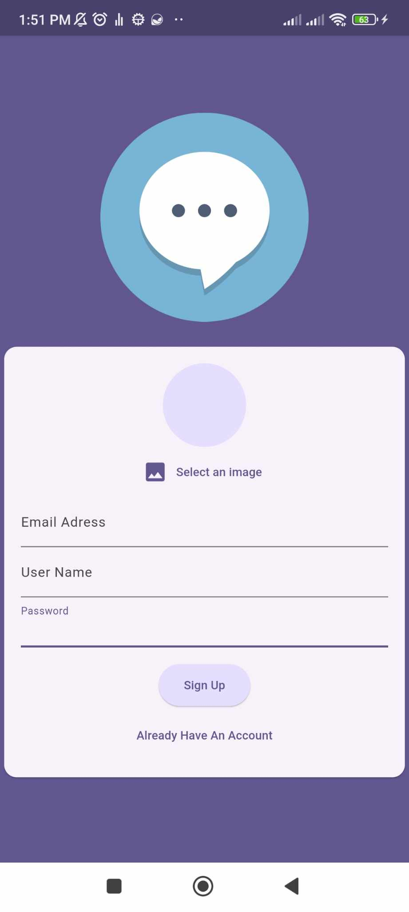
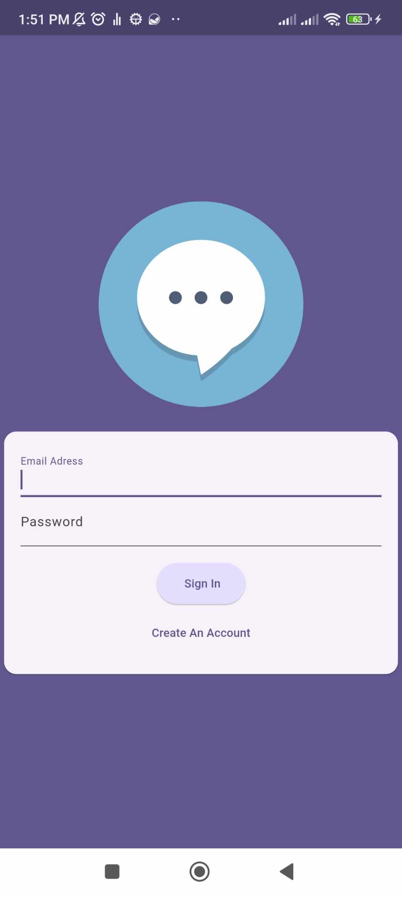
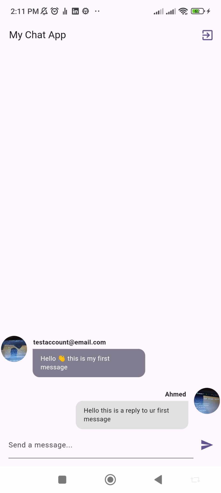

# Flutter Chat Application

This is a simple chat application built with Flutter and Firebase. The app provides a straightforward user interface for signing up, signing in, and exchanging messages.

## Features

- **Sign-Up Screen**: Users can create a new account by providing an image, email, username, and password.
- **Sign-In Screen**: Users can log in using their email and password.
- **Chat Screen**: The app includes a chat interface where users can view and send messages.
- **Messaging**: The chat screen starts with zero messages and supports conversation with messages from different users.

## Screenshots

### 1. Sign-Up Screen

### 2. Sign-In Screen

### 3. Chat Screen (No Messages)

### 4. Chat Screen (With Messages)

## Technology Stack

- **Flutter**: For building the cross-platform user interface.
- **Firebase**: Used for backend services including authentication and real-time database.

